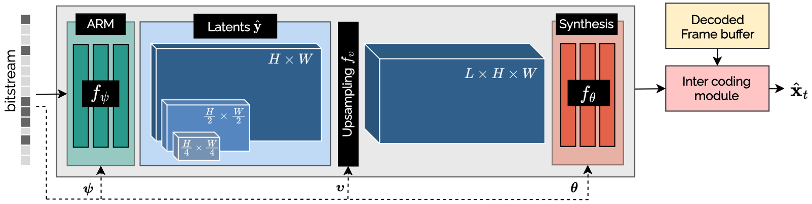
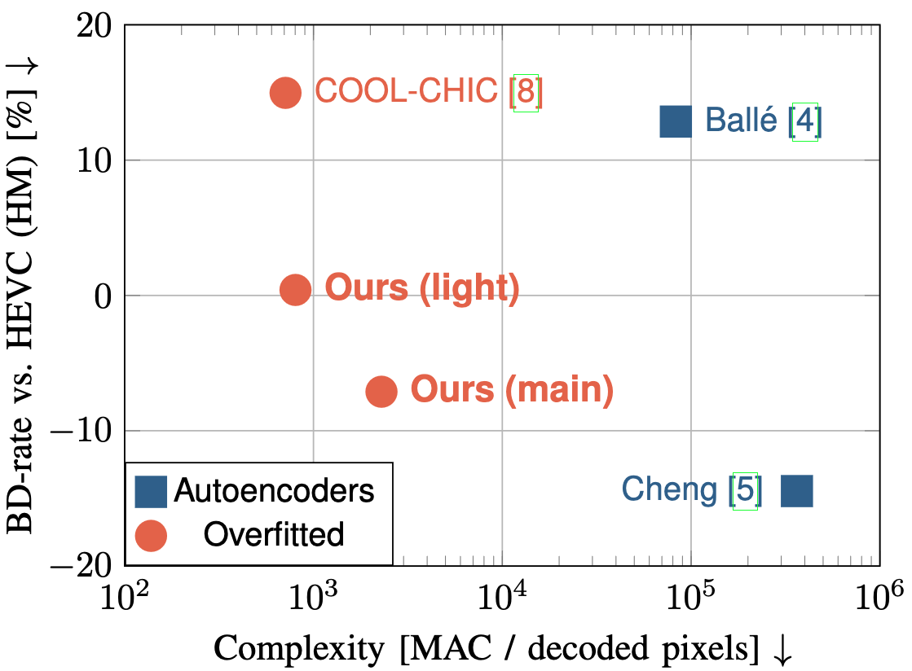
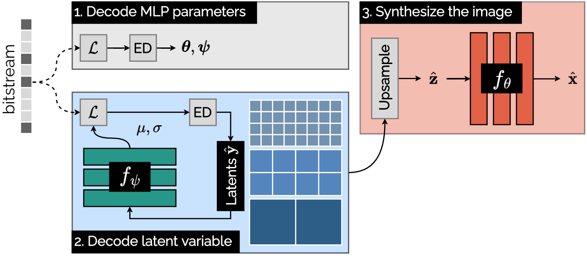
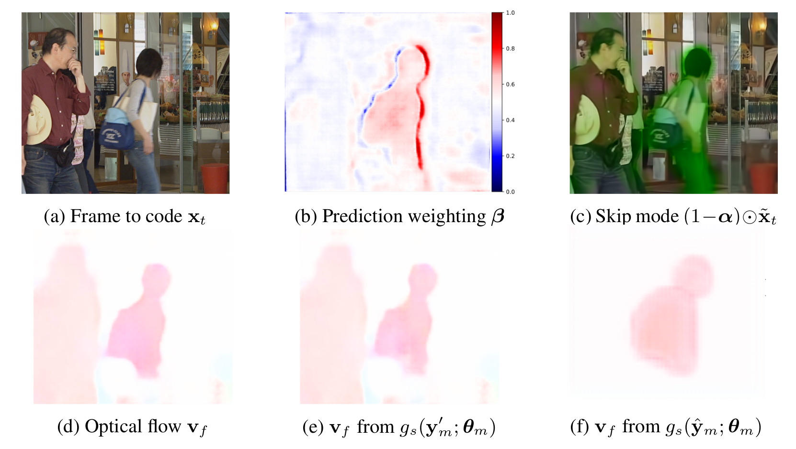
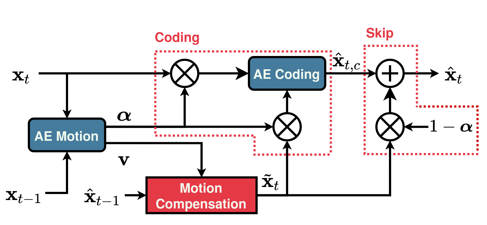

## Checkout our open-source lightweight learned codec [_Cool-chic_](https://orange-opensource.github.io/Cool-Chic/) 😎

## Short Bio

I defended my PhD on "_Design of Learned Video Coding Schemes_" in October 2021. My current work focuses on Cool-chic, a lightweight neural image & video codec based on overfitting.

## Updates

* 📄 Mars 2024: Papers about Cool-chic video presented @ [_IEEE DCC 2024_](https://www.cs.brandeis.edu/~dcc/)

* 🖥️ February 2024: Open-source release of [_Cool-chic video_](https://orange-opensource.github.io/Cool-Chic/)

* 📄 October 2023: Papers about Cool-chic presented @ [_ICCV 2023_](https://iccv2023.thecvf.com/) and [_IEEE MMSP 2023_](https://attend.ieee.org/mmsp-2023/)

* 🖥️ February 2023: Open-source release of [_Cool-chic_](https://orange-opensource.github.io/Cool-Chic/): a lightweight neural image codec

* 📄 October 2022: Paper presented @ [_IEEE ICIP 2022_](https://2022.ieeeicip.org/) presenting AIVC, a learned video codec.

* 🎓 October 2021: I received my PhD in signal processing from the University of Rennes, France. My thesis manuscript is available [_here_](https://github.com/theoladune/theoladune.github.io/blob/master/ressources/thesis-ladune.pdf).

* 🥇 June 2021: Two papers accepted at the [_Challenge of Learned Image Coding_](http://compression.cc) @ CVPR 2021. One of them won the challenge.

* 🥇 September 2020: I received the best paper award @ [_IEEE MMSP 2020_](https://attend.ieee.org/mmsp-2020/mmsp-2021/)

# Publications

## Cool-chic-related articles

My current work revolves around the design of [_Cool-chic_](https://orange-opensource.github.io/Cool-Chic/), an open-source lightweight neural image & video codec based on overfiting. Some relevevant papers about Cool-chic are:

### [_Cool-chic video: Learned video coding with 800 parameters_](https://arxiv.org/abs/2402.03179)

T. Leguay,, __T. Ladune__, P. Philippe, O. Déforges IEEE DCC 2024

[Paper](https://arxiv.org/pdf/2402.03179.pdf) / [Code](https://github.com/Orange-OpenSource/Cool-Chic)

We propose a lightweight learned video codec with 900 multiplications per decoded pixel and 800 parameters overall. To the best of our knowledge, this is one of the neural video codecs with the lowest decoding complexity. It is built upon the overfitted image codec Cool-chic and supplements it with an inter coding module to leverage the video's temporal redundancies. The proposed model is able to compress videos using both low-delay and random access configurations and achieves rate-distortion close to AVC while out-performing other overfitted codecs such as FFNeRV. The system is made open-source. 

### [_Low-complexity Overfitted Neural Image Codec_](https://arxiv.org/abs/2307.12706)

T. Leguay,, __T. Ladune__, P. Philippe, C. Clare, F. Henry IEEE MMSP 2023

[Paper](https://arxiv.org/pdf/2307.12706.pdf) / [Code](https://github.com/Orange-OpenSource/Cool-Chic)

We propose a neural image codec at reduced complexity which overfits the decoder parameters to each input image. While autoencoders perform up to a million multiplications per decoded pixel, the proposed approach only requires 2300 multiplications per pixel. Albeit low-complexity, the method rivals autoencoder performance and surpasses HEVC performance under various coding conditions. Additional lightweight modules and an improved training process provide a 14% rate reduction with respect to previous overfitted codecs, while offering a similar complexity. This work is made open-source. 
     
### [_COOL-CHIC: Coordinate-based Low Complexity Hierarchical Image Codec_](https://arxiv.org/abs/2212.05458)

__T. Ladune__, P. Philippe, F. Henry, C. Clare, T. Leguay, ICCV 2023

[Paper](https://arxiv.org/pdf/2212.05458.pdf) / [Code](https://github.com/Orange-OpenSource/Cool-Chic)

We introduce COOL-CHIC, a Coordinate-based Low Complexity Hierarchical Image Codec. It is a learned alternative to autoencoders with 629 parameters and 680 multiplications per decoded pixel. COOL-CHIC offers compression performance close to modern conventional MPEG codecs such as HEVC and is competitive with popular autoencoder-based systems. This method is inspired by Coordinate-based Neural Representations, where an image is represented as a learned function which maps pixel coordinates to RGB values. The parameters of the mapping function are then sent using entropy coding. At the receiver side, the compressed image is obtained by evaluating the mapping function for all pixel coordinates. COOL-CHIC implementation is made open-source. 

### Other papers relevant for Cool-chic

* [_Cool-Chic: Perceptually Tuned Low Complexity Overfitted Image Coder_](https://arxiv.org/abs/2401.02156). Cool-chic-based submission to the CLIC 2024 image track

## AIVC-related articles

My first few papers were centered around the design of [_AIVC_](https://orange-opensource.github.io/AIVC/), an open-source autoencoder-based video codec. Two important papers stand out among them:

### [_Conditional Coding for Flexible Learned Video Compression_](https://arxiv.org/pdf/2104.07930)

__T. Ladune__, P. Philippe, W. Hamidouche, L. Zhang, O. Déforges, ICLR 2021, Neural Compression Workshop

[Paper](https://arxiv.org/pdf/2104.07930.pdf) / [Video presentation](https://youtu.be/QjlFzAFTpa0) / [Slides](https://github.com/theoladune/theoladune.github.io/blob/master/ressources/slides/slides_ICLR21.pdf)

This paper introduces a novel framework for end-to-end learned video coding. Image compression is generalized through conditional coding to exploit information from reference frames, allowing to process intra and inter frames with the same coder. The system is trained through the minimization of a rate-distortion cost, with no pre-training or proxy loss. Its flexibility is assessed under three coding configurations (All Intra, Low-delay P and Random Access), where it is shown to achieve performance competitive with the state-of-the-art video codec HEVC. 

### [_Optical Flow and Mode Selection for Learning-based Video Coding_](https://arxiv.org/abs/2008.02580)

__T. Ladune__, P. Philippe, W. Hamidouche, L. Zhang, O. Déforges, IEEE MMSP 2020

[Paper](https://arxiv.org/abs/2008.02580.pdf) / [Video presentation](https://youtu.be/e-BSa8okMXI) / [Slides](https://github.com/theoladune/theoladune.github.io/blob/master/ressources/slides/slides_MMSP20.pdf)

__This work received the best paper award at the MMSP 2020 conference 🥇.__

This paper introduces a new method for inter-frame coding based on two complementary autoencoders: MOFNet and
CodecNet. MOFNet aims at computing and conveying the Optical Flow and a pixel-wise coding Mode selection. The optical flow is used to perform a prediction of the frame to code. The coding mode selection enables competition between direct copy of the prediction or transmission through CodecNet.

The proposed coding scheme is assessed under the Challenge on Learned Image Compression 2020 (CLIC20) P-frame coding
conditions, where it is shown to perform on par with the state-of- the-art video codec ITU/MPEG HEVC. Moreover, the possibility of copying the prediction enables to learn the optical flow in an end-to-end fashion i.e. without relying on pre-training and/or a dedicated loss term.

### Other papers relevant for AIVC

* [PhD thesis](https://github.com/theoladune/theoladune.github.io/blob/master/ressources/thesis-ladune.pdf)

* [_Artificial Intelligence based Video Codec (AIVC) for CLIC 2022_](https://arxiv.org/abs/2206.13934). AIVC-based submission to the CLIC 2022 video track

* [_AIVC: Artificial Intelligence based Video Codec_, Ladune et al., IEEE ICIP 2022](https://arxiv.org/abs/2202.04365). Summarizing the design of AIVC.

* [_Conditional Coding and Variable Bitrate for Practical Learned Video Coding_, Ladune et al., IEEE CVPR 2021, CLIC Workshop](https://arxiv.org/abs/2104.09103). AIVC-based submission to the CLIC 2021 video track.

* [_ModeNet: Mode Selection Network For Learned Video Coding_, Ladune et al., IEEE MLSP 2020](https://arxiv.org/abs/2007.02532). First mention of mode selection for a learned codec.

* [_Binary Probability Model for Learning Based Image Compression_, Ladune et al., IEEE ICASSP 2020](https://arxiv.org/abs/2002.09259). Enhancing the probability model of a learned codec.
