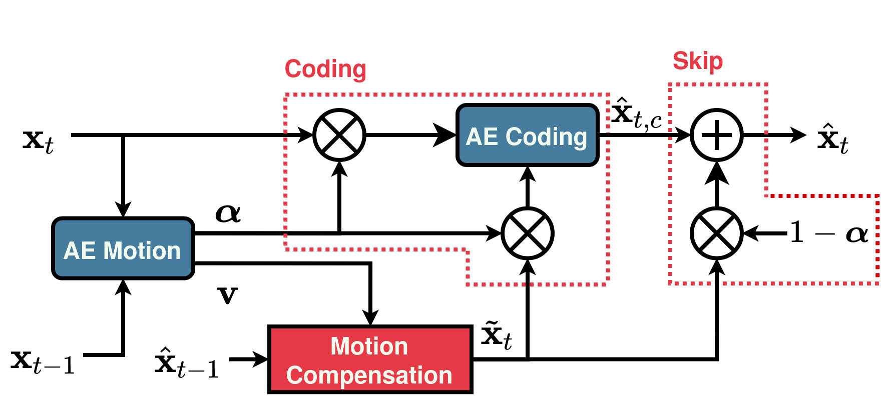

## Short Bio

I am a PhD student at Orange Labs / INSA Rennes since October 2018, working on "_Learning-based complementary approaches for video coding_". 
My work focuses on novel __deep learning-based__ coding schemes for __image and video compression__. The objective is to leverage the high abstraction capacity of neural networks to achieve more efficient compression than traditional codecs. 

## Publications

### [_Optical Flow and Mode Selection for Learning-based Video Coding_](https://arxiv.org/abs/2008.02580)

__T. Ladune__, P. Philippe, W. Hamidouche, L. Zhang, O. Déforges, MMSP 2020

[Paper](https://arxiv.org/abs/2008.02580.pdf) / [Video presentation](https://youtu.be/e-BSa8okMXI) / [Slides](https://github.com/theoladune/theoladune.github.io/blob/master/ressources/slides/slides_MMSP20.pdf)

__This work received the best paper award at the MMSP 2020 conference.__

This paper introduces a new method for inter-frame coding based on two complementary autoencoders: MOFNet and
CodecNet. MOFNet aims at computing and conveying the Optical Flow and a pixel-wise coding Mode selection. The optical flow is used to perform a prediction of the frame to code. The coding mode selection enables competition between direct copy of the prediction or transmission through CodecNet.

The proposed coding scheme is assessed under the Challenge on Learned Image Compression 2020 (CLIC20) P-frame coding
conditions, where it is shown to perform on par with the state-of- the-art video codec ITU/MPEG HEVC. Moreover, the possibility of copying the prediction enables to learn the optical flow in an end-to-end fashion i.e. without relying on pre-training and/or a dedicated loss term.

### [_ModeNet: Mode Selection Network For Learned Video Coding_](https://arxiv.org/abs/2007.02532)

__T. Ladune__, P. Philippe, W. Hamidouche, L. Zhang, O. Déforges, MLSP 2020

[Paper](https://arxiv.org/pdf/2007.02532.pdf) / [Video presentation](https://youtu.be/AlFJhlrpxWw) / [Slides](https://github.com/theoladune/theoladune.github.io/blob/master/ressources/slides/slides_MLSP20.pdf)

We propose a mode selection network (ModeNet) to enhance deep learning-based video compression. Inspired by traditional video coding, ModeNet purpose is to enable competition among several coding modes. The proposed ModeNet learns and conveys a pixel-wise partitioning of the frame, used to assign each pixel to the most suited coding mode.

### [_Binary Probability Model for Learning Based Image Compression_](https://arxiv.org/abs/2002.09259)

__T. Ladune__, P. Philippe, W. Hamidouche, L. Zhang, O. Déforges, ICASSP 2020

[Paper](https://arxiv.org/pdf/2002.09259) / [Video presentation](https://youtu.be/COVyZ-IkjTQ) / [Slides](https://github.com/theoladune/theoladune.github.io/blob/master/ressources/slides/slides_ICASSP20.pdf)

We propose to enhance learned image compression systems with a richer probability model for the latent variables. Previous works model the latents with a Gaussian or a Laplace distribution. Inspired by binary arithmetic coding, we propose to signal the latents with three binary values and one integer, with different probability models.