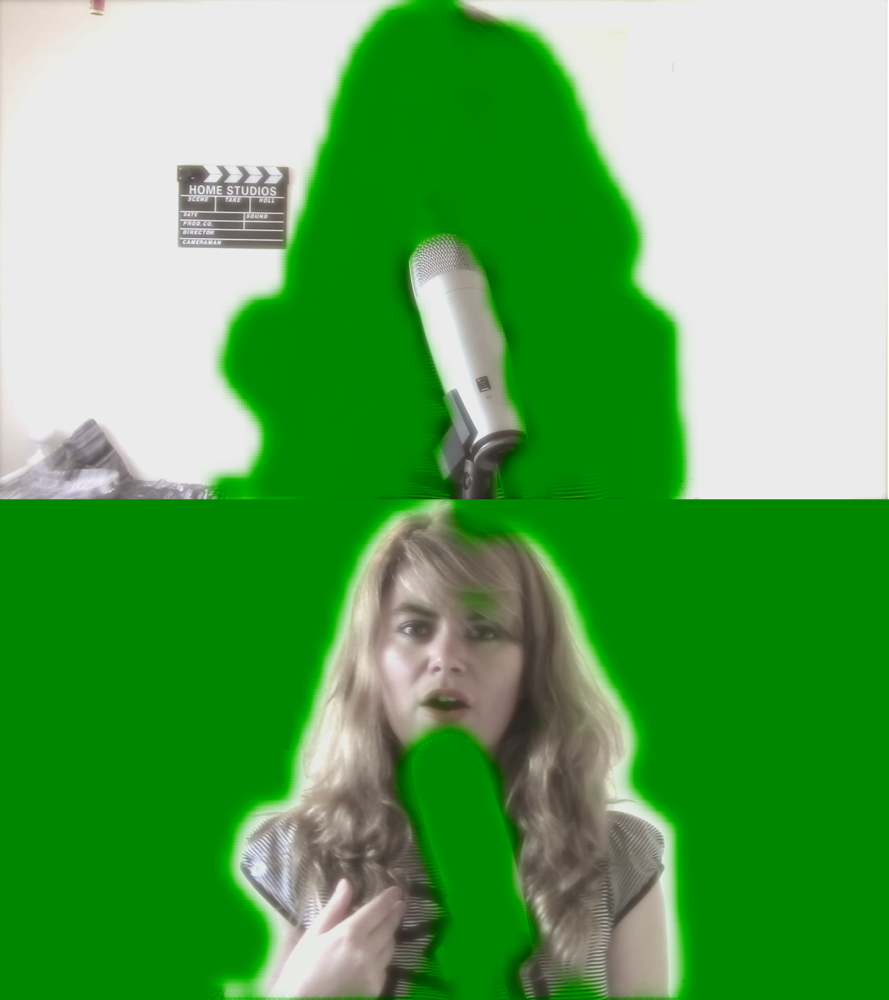
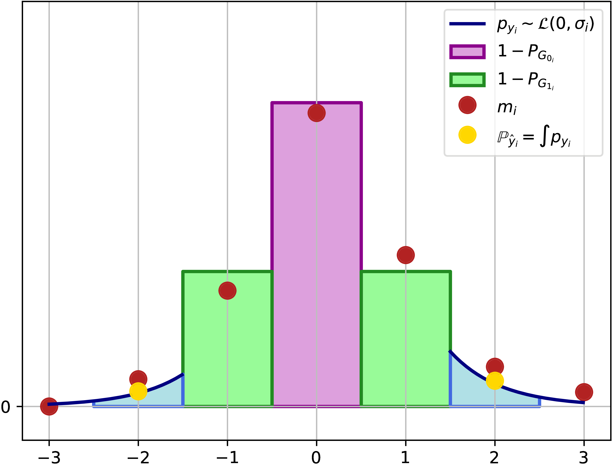

I am a PhD student at Orange Labs / INSA Rennes since October 2018, working on "_Learning-based complementary approaches for video coding_". 
My work focuses on novel __deep learning-based__ coding schemes for __image and video compression__. The objective is to leverage the high abstraction capacity of neural networks to achieve more efficient compression than traditional codecs. 

## Publications

### [_ModeNet: Mode Selection Network For Learned Video Coding_](https://arxiv.org/abs/2007.02532)

<!--  -->

__T. Ladune__, P. Philippe, W. Hamidouche, L. Zhang, O. Déforges, MLSP 2020

[Paper](https://arxiv.org/pdf/2007.02532.pdf) / [Video presentation]() _coming soon_ / [Slides]() _coming soon_

We propose a mode selection network (ModeNet) to enhance deep learning-based video compression. Inspired by traditional video coding, ModeNet purpose is to enable competition among several coding modes. The proposed ModeNet learns and conveys a pixel-wise partitioning of the frame, used to assign each pixel to the most suited coding mode.

### [_Binary Probability Model for Learning Based Image Compression_](https://arxiv.org/abs/2002.09259)

__T. Ladune__, P. Philippe, W. Hamidouche, L. Zhang, O. Déforges, ICASSP 2020

[Paper](https://arxiv.org/pdf/2002.09259) / [Video presentation](https://youtu.be/COVyZ-IkjTQ) / [Slides](https://github.com/theoladune/BinaryProbabilityModel/blob/master/slides_ICASSP.pdf)

We propose to enhance learned image compression systems with a richer probability model for the latent variables. Previous works model the latents with a Gaussian or a Laplace distribution. Inspired by binary arithmetic coding, we propose to signal the latents with three binary values and one integer, with different probability models.